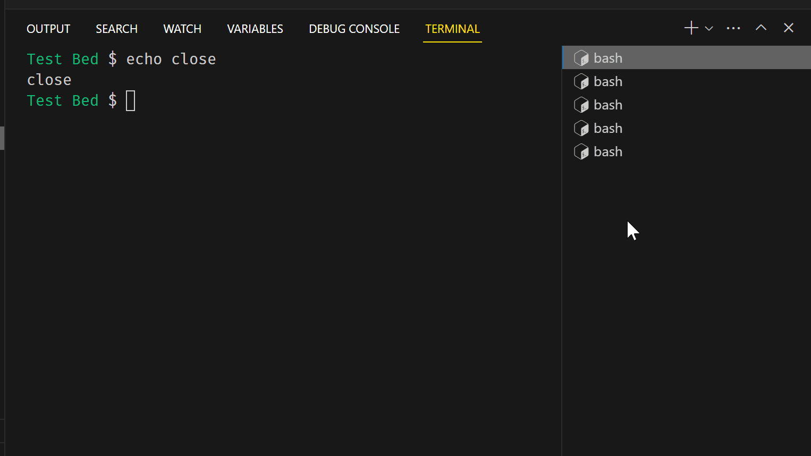

# Close other Terminals

This vscode extension adds a command to the editor tabs' context menu: `Close other Terminals`  

## Extension Commands

This extension contributes the following command:

* `close-other-terminals.close`: Close all other terminals

You can select any number of terminals (with the <kbd>Shift</kbd> key), right-click on one of them, and any non-selected terminals will be closed.

## Known Issues

## Release Notes

0.0.1
